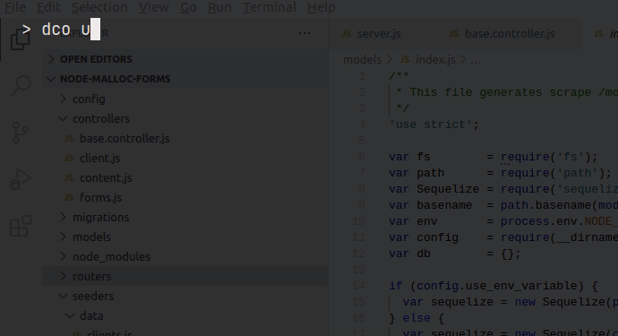

# node-malloc-forms

To run services run the docker-compose file inside the root folder.
Database can be accesed via adminer container on :8080 with following
```
postgres
example
forms
```

SQL Fetch json

```
SELECT content ->> 'products' AS product
FROM content;
```




